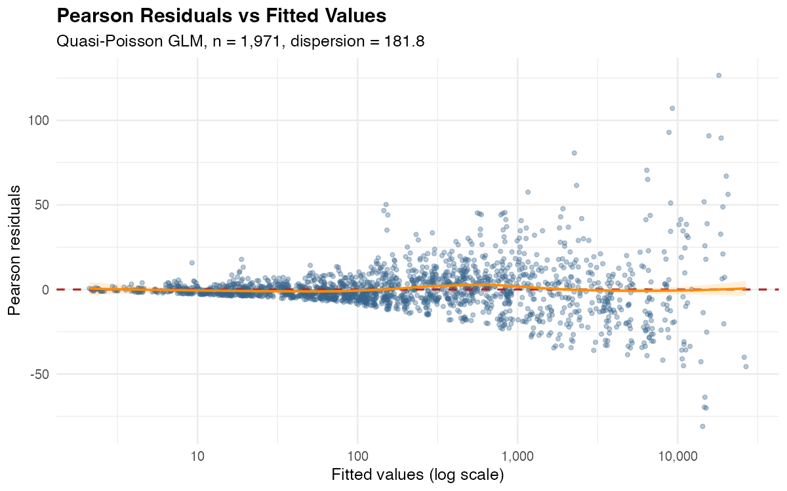
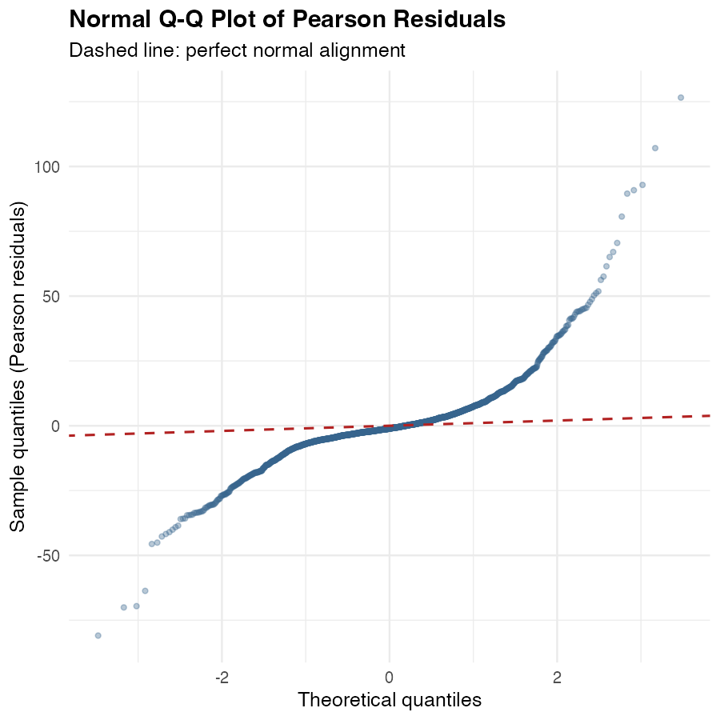
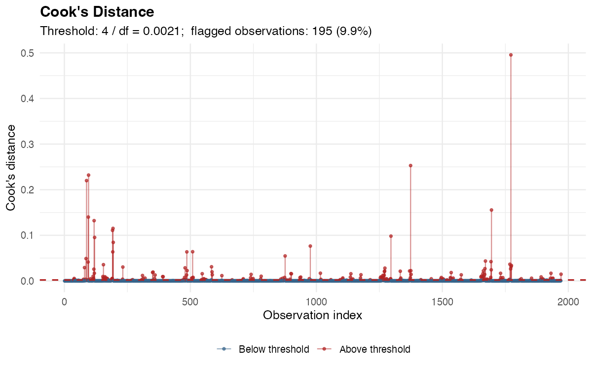
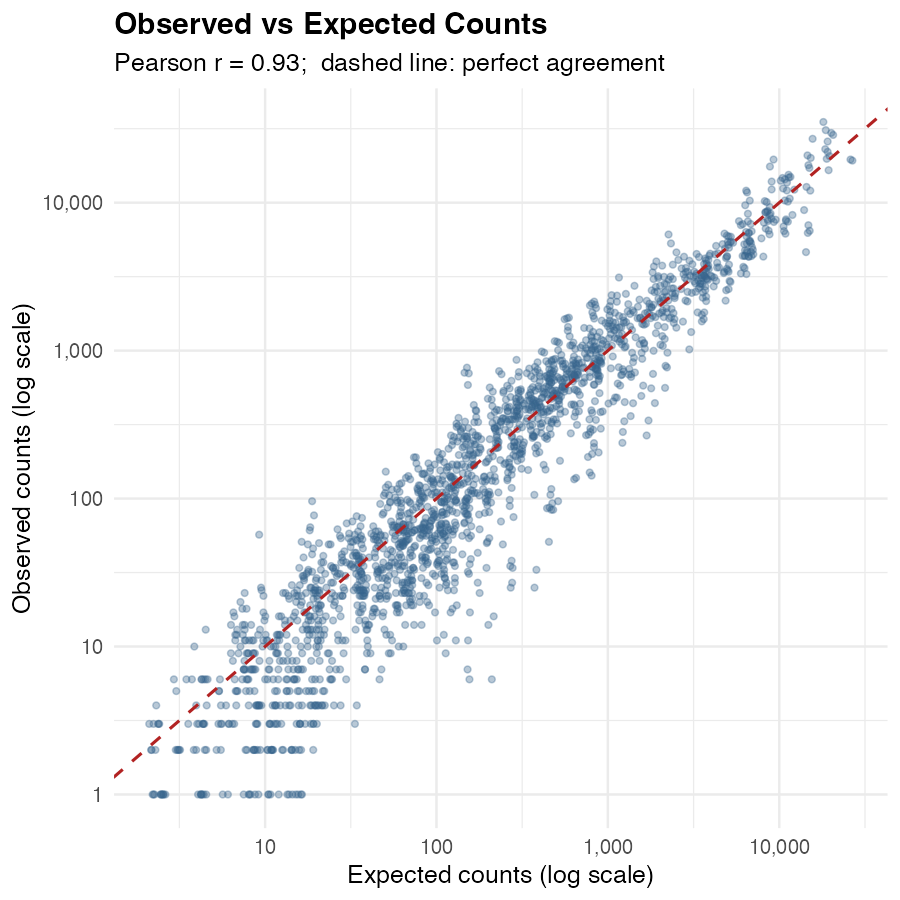

# Appendix A: Model Diagnostics {#sec-appendix-diagnostics .appendix}

This appendix presents regression diagnostics for the pooled Quasi-Poisson
generalised linear model described in @sec-pooled-model. The diagnostics
assess whether the model's linear predictor is correctly specified and
whether any individual observations exert disproportionate influence on the
estimated incidence rate ratios (IRRs). All figures were produced by
`analysis/07_model_diagnostics.R` and are fully reproducible from the
repository.

## A.1 Pearson Residuals vs Fitted Values

```{r diag-setup, include=FALSE}
library(tidyverse)
library(knitr)
library(kableExtra)

diag_summary <- read_csv(
  "../analysis/output/diag_summary.csv",
  show_col_types = FALSE
)

get_val <- function(metric_name) {
  diag_summary |> filter(metric == metric_name) |> pull(value)
}
```

```{r fig-pearson, echo=FALSE, fig.cap="Pearson residuals plotted against fitted values on a log scale. The orange loess smoother runs close to zero across the full range of fitted values, indicating no systematic trend in the residuals.", out.width="90%"}

```

The Pearson residual for stratum $i$ is defined as:

$$r_i^P = \frac{y_i - \hat{\mu}_i}{\sqrt{\hat{\mu}_i}}$$

where $y_i$ is the observed search count and $\hat{\mu}_i$ is the model's
fitted value. For a well-specified model, these residuals should be centred
at zero with no systematic pattern across the fitted value range.

@fig-pearson shows the loess smoother remaining flat along the zero line
across three orders of magnitude of fitted values. This indicates that the
model's linear predictor captures the systematic variation in search counts
without meaningful directional bias. The widening scatter at large fitted
values is the expected consequence of count-data variance scaling with the
mean: rather than indicating misspecification, it reflects the heterogeneity
that motivated the Quasi-Poisson family in the first place. The dispersion
parameter is $\hat{\phi} =$ `r round(get_val("Dispersion parameter"), 1)`, and
the Quasi-Poisson framework corrects all confidence intervals for this by
scaling standard errors by $\sqrt{\hat{\phi}}$.


## A.2 Normal Q-Q Plot of Pearson Residuals

```{r fig-qq, echo=FALSE, fig.cap="Normal Q-Q plot of Pearson residuals. The S-shaped departure from the dashed line in both tails is consistent with the extreme overdispersion present in the data and does not indicate misspecification of the linear predictor.", out.width="75%"}

```

@fig-qq compares the empirical quantiles of the Pearson residuals against
the quantiles of a standard normal distribution. Perfect normality would
place all points on the dashed line. The observed S-shaped curve, with
heavier tails on both sides, is a predictable consequence of modelling
count data with a dispersion parameter as large as
`r round(get_val("Dispersion parameter"), 1)`: the residuals are not
drawn from a standard normal, and there is no theoretical reason to expect
them to be. What the plot does confirm is approximate symmetry around zero
in the central mass of the distribution, which is the relevant property
for the validity of the coefficient estimates. The heavy tails are addressed
through the Quasi-Poisson variance correction rather than through any
transformation of the response.


## A.3 Cook's Distance

```{r fig-cooks, echo=FALSE, fig.cap="Cook's distance for each of the 1,971 strata. Red points exceed the conventional threshold of 4 / df (dashed line). The most influential stratum has a Cook's distance of approximately 0.50.", out.width="95%"}

```

Cook's distance measures the aggregate change in all coefficient estimates
when a single observation is removed. The conventional threshold used here
is $4 / \text{df}_\text{residual} =$ `r round(get_val("Cook's threshold (4/df)"), 4)`.
With `r round(get_val("Observations above Cook's threshold"), 0) |> as.integer()`
strata (`r get_val("Observations above Cook's threshold (%)")`%) exceeding
this threshold (@fig-cooks), the model is working on data where a small
number of high-volume subgroups carry meaningful leverage.

Inspecting the top ten strata by Cook's distance reveals a consistent
pattern: they are all either male drug-related searches in the North West
(where the model underpredicts observed counts by a factor of roughly two
in 2023/24 and 2024/25) or male searches in London involving Black and
Asian groups in 2020/21. These are genuine observations, not recording
errors. The North West pattern is consistent with documented increases in
suspicionless Section 60 stop and search activity in that region over the
later years of the study period. The London strata reflect the capital's
disproportionately large and concentrated minority populations combined with
high absolute search volumes.

The sensitivity analysis in @sec-appendix-sensitivity directly addresses
whether these influential strata materially alter the ethnicity IRRs by
testing specifications that progressively exclude or modify the high-leverage
subgroups.


## A.4 Observed vs Expected Counts

```{r fig-oe, echo=FALSE, fig.cap="Observed counts plotted against model-expected counts on a log-log scale. Points track closely along the 1:1 dashed line across four orders of magnitude, with Pearson r = 0.93.", out.width="75%"}

```

@fig-oe plots observed against expected counts on a logarithmic scale,
covering strata from single-digit to tens of thousands of searches.
The Pearson correlation between observed and expected is
`r get_val("Obs vs expected Pearson r")`, and the points track the 1:1
line closely across the full range. The modest scatter at very low counts
(bottom left) reflects the difficulty any aggregate model has in predicting
sparse cells, but these strata contribute negligibly to the overall
disparity estimates due to their small volumes.

Taken together, the four diagnostics support the conclusion that the pooled
Quasi-Poisson model is appropriately specified. The primary limitation is
not structural bias in the linear predictor but rather regional
heterogeneity that the model partially absorbs through the region fixed
effect. The robustness of the key ethnicity IRRs to this heterogeneity is
examined in @sec-appendix-sensitivity.


## A.5 Summary of Diagnostic Statistics

```{r tbl-diag-summary, echo=FALSE}
diag_summary |>
  filter(metric %in% c(
    "Observations (strata)",
    "Degrees of freedom (residual)",
    "Dispersion parameter",
    "Residual deviance",
    "Null deviance",
    "Pseudo R-squared (McFadden)",
    "Cook's threshold (4/df)",
    "Observations above Cook's threshold (%)",
    "Dispersion-scaled Pearson residuals > 2 (%)",
    "Obs vs expected Pearson r"
  )) |>
  mutate(value = case_when(
    metric == "Dispersion parameter"              ~ as.character(round(value, 1)),
    metric == "Pseudo R-squared (McFadden)"       ~ as.character(round(value, 3)),
    metric == "Cook's threshold (4/df)"           ~ as.character(round(value, 4)),
    metric %in% c("Observations above Cook's threshold (%)",
                  "Dispersion-scaled Pearson residuals > 2 (%)")  ~ paste0(value, "%"),
    metric == "Obs vs expected Pearson r"         ~ as.character(round(value, 3)),
    TRUE ~ format(round(value, 0), big.mark = ",")
  )) |>
  kable(
    col.names = c("Diagnostic metric", "Value"),
    caption   = "Summary of key diagnostic statistics for the pooled Quasi-Poisson GLM. The dispersion-scaled Pearson residual row divides each raw Pearson residual by sqrt(phi) before applying the ±2 threshold; using raw residuals against ±2 would be uninformative when phi >> 1.",
    align     = c("l", "r"),
    booktabs  = TRUE
  ) |>
  kable_styling(bootstrap_options = c("striped", "hover"), full_width = FALSE)
```
