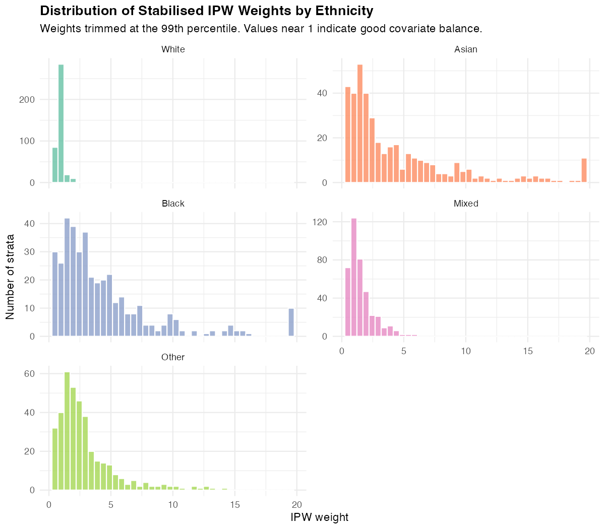
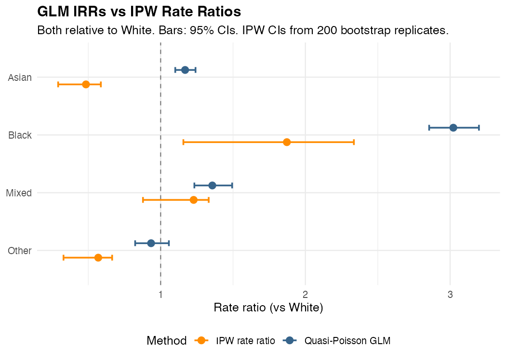

# Appendix C: Inverse Propensity Weighted Estimates {#sec-appendix-ipw .appendix}

The main analysis uses a Quasi-Poisson GLM to estimate the association between
ethnicity and stop and search rates while adjusting for year, region, sex, age
group, and reason for search. This regression approach produces estimates of the
ethnicity effect **conditional** on the observed covariate values. A complementary
approach, here implemented using stabilised inverse propensity weights (IPW),
models the probability of belonging to each ethnic group given the same covariates,
then uses those probabilities to reweight the observed searched population so
that the covariate distributions are equalised across groups. This is most
precisely described as **direct standardisation** of the searched population's
covariate mix: because the propensity model is fitted on people who were already
stopped (weighted by search count), the resulting rate ratios describe what the
disparity would look like if all ethnic groups had the same covariate profile
within the searched population, rather than providing a causal estimate in the
general population sense.

Comparing GLM and IPW-standardised estimates is informative in two ways. First,
if the two methods produce similar rate ratios, the findings are unlikely to
depend on the parametric assumptions of the regression model. Second, where the
estimates diverge, the divergence reveals something substantive: differences in
how ethnic groups are distributed across high- and low-stop conditions.

All computations are implemented in `analysis/09_ipw.R`.

```{r ipw-setup, include=FALSE}
library(tidyverse)
library(knitr)
library(kableExtra)

ipw_comp    <- read_csv("../analysis/output/ipw_comparison.csv",
                        show_col_types = FALSE)
ipw_rates   <- read_csv("../analysis/output/ipw_rates.csv",
                        show_col_types = FALSE)
ipw_pscore  <- read_csv("../analysis/output/ipw_propensity_summary.csv",
                        show_col_types = FALSE)

black_glm  <- ipw_comp |> filter(ethnicity == "Black")
black_ipw  <- ipw_rates |> filter(ethnicity == "Black")
asian_glm  <- ipw_comp |> filter(ethnicity == "Asian")
```


## C.1 Method

**Propensity model.** A multinomial logistic regression is fitted to the
modelling dataset, predicting ethnicity from the same five covariates used
in the GLM: financial year, region, sex, age group, and reason for search.
Each stratum is weighted by its search count so that the model estimates
$\hat{P}(\text{ethnicity} \mid \text{covariates})$ within the searched
population, not in the general population. The model converged in all cases.

**Stabilised weights.** For each stratum $i$ with observed ethnicity $g_i$,
the stabilised IPW weight is:

$$w_i = \frac{\hat{P}(E = g_i)}{\hat{P}(E = g_i \mid X_i)}$$

where $\hat{P}(E = g_i)$ is the marginal proportion of ethnicity $g_i$ in the
searched population and $\hat{P}(E = g_i \mid X_i)$ is the predicted
probability from the propensity model. Stabilising by the marginal probability
reduces variance relative to unstabilised weights. Weights are trimmed at the
99th percentile (threshold: 19.4) to limit the influence of extreme values;
20 strata are affected by this trimming.

**IPW rate ratios.** Weighted search rates per 1,000 population are computed
for each ethnic group and divided by the weighted White rate to give IPW rate
ratios. Bootstrap percentile confidence intervals (B = 200) are obtained by
resampling modelling strata with replacement and repeating the full weighting
procedure.


## C.2 Weight Distributions

```{r fig-ipw-weights, echo=FALSE, fig.cap="Distribution of stabilised IPW weights by ethnicity group. White weights are highly concentrated near their mean (0.87), indicating that White people's covariate profile closely matches the overall searched population. Asian and Black weights are more dispersed and larger on average, reflecting the concentration of these groups in high-stop conditions such as London.", out.width="95%"}

```

@fig-ipw-weights shows the weight distributions by ethnicity. For White
individuals, mean weight = `r round(ipw_pscore |> filter(ethnicity == "White") |> pull(mean_ipw), 2)`,
concentrated close to 1, which indicates that White people's observed covariate
distribution closely resembles the overall searched population. For Black
individuals, mean weight = `r round(ipw_pscore |> filter(ethnicity == "Black") |> pull(mean_ipw), 2)`,
and for Asian individuals mean weight = `r round(ipw_pscore |> filter(ethnicity == "Asian") |> pull(mean_ipw), 2)`.
These larger weights reflect the fact that Black and Asian people are
over-represented in conditions (particularly London, drug-related searches,
younger age groups) where overall stop rates are high. The IPW procedure
up-weights these individuals to represent what their rates would be if their
covariate profile matched the full searched population.

The moderate extent of weight trimming (20 strata at the 99th percentile)
suggests the propensity model achieves reasonable coverage without extreme
extrapolation.


## C.3 GLM vs IPW Comparison

```{r fig-ipw-comp, echo=FALSE, fig.cap="GLM incidence rate ratios (blue) and IPW rate ratios (orange) for each non-White ethnic group, relative to White. Both estimates and their 95% confidence intervals are shown. The Black/White disparity is large under both methods. The Asian disparity reverses sign under IPW, indicating that the GLM Asian coefficient largely reflects covariate concentration rather than differential treatment.", out.width="85%"}

```

```{r tbl-ipw-comp, echo=FALSE}
ipw_comp |>
  arrange(desc(glm_irr)) |>
  kable(
    col.names = c("Ethnicity", "GLM IRR", "GLM CI lo", "GLM CI hi",
                  "IPW RR", "IPW CI lo", "IPW CI hi"),
    caption   = "GLM IRRs and IPW rate ratios with 95% confidence intervals. All estimates are relative to White. GLM CIs use the normal approximation; IPW CIs are percentile bootstrap intervals (B = 200).",
    digits    = 3,
    align     = c("l", "r", "r", "r", "r", "r", "r"),
    booktabs  = TRUE
  ) |>
  kable_styling(bootstrap_options = c("striped", "hover"), full_width = FALSE) |>
  add_header_above(c(" " = 1, "Quasi-Poisson GLM" = 3, "IPW" = 3))
```

@fig-ipw-comp and @tbl-ipw-comp present the side-by-side comparison. Three
patterns are worth noting.

**Black/White disparity: large under both methods.** The GLM IRR is
`r black_glm$glm_irr` (95% CI: `r black_glm$glm_ci_lo`, `r black_glm$glm_ci_hi`)
and the IPW rate ratio is `r black_glm$ipw_rr_pt`
(95% CI: `r black_glm$ipw_ci_lo`, `r black_glm$ipw_ci_hi`). The IPW estimate
is lower, which is expected: the conditional GLM estimate asks "among people
searched for the same reason, in the same region, of the same sex and age, what
is the Black/White rate ratio?", while the IPW estimate asks "if Black and White
people had the same overall covariate profile, what would the rate ratio be?"
Because Black people are more concentrated in high-stop conditions (London,
drug searches), the marginal IPW rate ratio is smaller than the conditional GLM
IRR. Critically, both estimates are well above 1, and the IPW lower bound
(`r black_glm$ipw_ci_lo`) excludes 1. The Black/White disparity is therefore
robust to the choice of estimand and method.

**Asian/White: divergence reveals geographic concentration.** The GLM estimates
a modest positive disparity (IRR = `r asian_glm$glm_irr`), but the IPW method
produces a rate ratio of `r asian_glm$ipw_rr_pt`
(95% CI: `r asian_glm$ipw_ci_lo`, `r asian_glm$ipw_ci_hi`), well below 1.
The mean Asian propensity weight of
`r round(ipw_pscore |> filter(ethnicity == "Asian") |> pull(mean_ipw), 2)`
is the largest of any group, indicating that the Asian-searched population is
concentrated in conditions with high stop rates for all groups. Once the
reweighting equalises those conditions, the Asian rate falls below the White
rate. In other words, the positive GLM coefficient for Asian individuals
reflects primarily their geographic and demographic concentration
(particularly in London and in drug-related searches), not evidence of
differential treatment conditional on being in similar circumstances.
This does not imply the absence of racial discrimination in Asian stops, but it
does show that the mechanism differs from the Black/White case.

**Mixed and Other groups.** The IPW rate ratios for Mixed (1.23, CI: 0.88,
1.33) and Other (0.57, CI: 0.33, 0.67) are somewhat lower than the
corresponding GLM estimates, consistent with partial geographic concentration
effects. The Mixed group shows a positive but uncertain IPW disparity. The Other
group has lower rates than White under both methods.


## C.4 Interpretation and Limitations

The GLM and IPW analyses are complementary rather than competing. The GLM
IRR is the appropriate summary for the question "within comparable conditions,
are Black individuals stopped more than White individuals?", to which the answer
is yes, by a factor of approximately 3. The IPW rate ratio addresses "across
the whole searched population, standardised to a common covariate profile, what
is the disparity?", to which the answer is also yes, by a factor of
approximately 1.9. Both are valid and both confirm a substantial Black/White
disparity.

Three limitations apply to this analysis. First, because the propensity model
is fitted on the searched population weighted by count, the estimates are more
accurately characterised as direct standardisation within the searched
population than as classical causal IPW in the general population. A causal
interpretation would additionally require an unconfoundedness assumption holding
in the full population, which cannot be verified here. Second, the analysis
relies on the propensity model being correctly specified within the searched
population; it uses the same covariates as the GLM and has no access to
unmeasured variables such as police force policies or local crime conditions.
Third, the large weights for Asian and Black groups (mean 4.5 and 4.4
respectively) indicate limited covariate overlap, which increases the variance
of the standardised estimates and means the bootstrap confidence intervals for
these groups are relatively wide.
