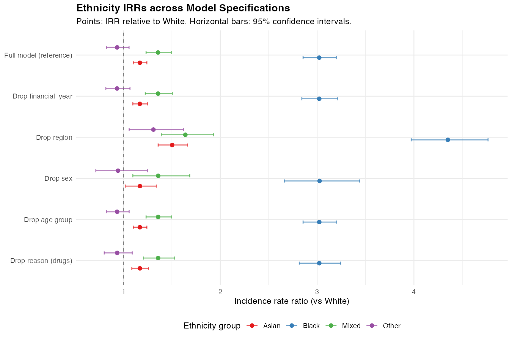
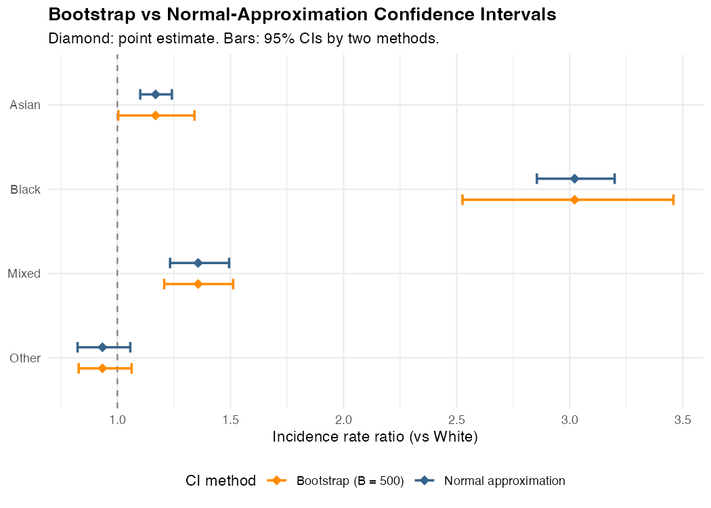

# Appendix B: Sensitivity Analysis {#sec-appendix-sensitivity .appendix}

This appendix assesses whether the ethnicity incidence rate ratios (IRRs)
reported in the main results are stable across three types of perturbation:
(1) dropping individual covariates from the model, one at a time; (2) replacing
the normal-approximation confidence intervals with non-parametric bootstrap
intervals; and (3) comparing the standard errors produced by a standard Poisson
model against those from the Quasi-Poisson model used in the main analysis. All
computations are implemented in `analysis/08_sensitivity.R`.

```{r sens-setup, include=FALSE}
library(tidyverse)
library(knitr)
library(kableExtra)

loocv      <- read_csv("../analysis/output/sensitivity_loocv.csv",
                       show_col_types = FALSE)
boot_ci    <- read_csv("../analysis/output/sensitivity_bootstrap.csv",
                       show_col_types = FALSE)
pois_vs_qp <- read_csv("../analysis/output/sensitivity_poisson_vs_qp.csv",
                       show_col_types = FALSE)

black_full <- loocv |>
  filter(ethnicity_group == "Black", specification == "Full model (reference)")
black_noreg <- loocv |>
  filter(ethnicity_group == "Black", specification == "Drop region")
black_boot  <- boot_ci |> filter(ethnicity == "Black")
se_ratio    <- pois_vs_qp |> filter(ethnicity == "Black") |> pull(se_ratio)
```


## B.1 Leave-One-Covariate-Out

The full model includes six predictors: financial year, region, ethnicity,
sex, age group, and reason for search. To assess which covariates act as
genuine confounders of the ethnicity effect, the model is re-estimated five
times, each time omitting one non-ethnicity predictor. The Black/White IRR
and its 95% confidence interval are extracted from each specification and
compared.

```{r fig-loocv, echo=FALSE, fig.cap="Ethnicity IRRs (relative to White) under six model specifications. Each row drops one covariate. All non-ethnicity ethnicity groups are also shown. The Black/White IRR is stable across all specifications except when region is removed.", out.width="100%"}

```

@fig-loocv shows that the Black/White IRR is
`r black_full$irr` (95% CI: `r black_full$irr_lower`, `r black_full$irr_upper`)
in the full model and remains at that level when financial year, sex, age group,
or reason for search is dropped. These four covariates are therefore not
meaningful confounders of the racial disparity estimate in this dataset.

The exception is region: removing the regional fixed effect inflates the
Black/White IRR to
`r black_noreg$irr` (95% CI: `r black_noreg$irr_lower`, `r black_noreg$irr_upper`).
This is expected. London combines the largest Black population in England with
the highest per-capita stop and search volume. Without controlling for region,
this concentration is partially absorbed into the ethnicity coefficient,
producing upward bias. Crucially, even the uncontrolled estimate of
`r black_noreg$irr` confirms a large disparity, so the Black/White finding is
not an artefact of the regional distribution of the population.

```{r tbl-loocv-black, echo=FALSE}
loocv |>
  filter(ethnicity_group == "Black") |>
  select(specification, irr, irr_lower, irr_upper) |>
  kable(
    col.names = c("Specification", "IRR", "Lower 95% CI", "Upper 95% CI"),
    caption   = "Black/White IRR under each leave-one-covariate-out specification.",
    digits    = 3,
    align     = c("l", "r", "r", "r"),
    booktabs  = TRUE
  ) |>
  kable_styling(bootstrap_options = c("striped", "hover"), full_width = FALSE) |>
  row_spec(
    which(loocv |> filter(ethnicity_group == "Black") |>
            pull(specification) == "Full model (reference)"),
    bold = TRUE
  )
```


## B.2 Bootstrap Confidence Intervals

The 95% confidence intervals in the main analysis are based on a normal
approximation: point estimate ± 1.96 × standard error. For GLMs with high
dispersion and influential observations (identified in @sec-appendix-diagnostics),
the normal approximation may understate uncertainty. As a non-parametric
alternative, 500 bootstrap replicates of the full model are fitted by
resampling the 1,971 modelling strata with replacement, and the 2.5th and
97.5th percentiles of the resulting coefficient distributions form the
bootstrap intervals.

```{r fig-bootstrap, echo=FALSE, fig.cap="Bootstrap (B = 500) and normal-approximation 95% confidence intervals for each ethnicity group. The diamond marks the point estimate. Bootstrap intervals are wider for the Black and Asian groups, reflecting the influence of high-leverage strata identified in Appendix A.", out.width="85%"}

```

@fig-bootstrap shows the comparison for all four non-White groups. For the
Black group, the bootstrap interval
(`r black_boot$irr_boot_lo`, `r black_boot$irr_boot_hi`) is wider than the
normal-approximation interval
(`r black_boot$irr_normal_lo`, `r black_boot$irr_normal_hi`), with the upper
bound extending further. Both intervals are well above 1, confirming that the
Black disparity is a robust finding. The bootstrap lower bound
(`r black_boot$irr_boot_lo`) represents a conservative minimum estimate of
the Black/White rate ratio.

For the Asian group, the bootstrap lower bound reaches 1.00, compared with
1.10 from the normal approximation. This indicates that the elevated Asian
stop rate is less precisely estimated than the main results suggest, driven
by the sensitivity of this coefficient to certain high-volume London strata.

For the Mixed and Other groups, bootstrap and normal-approximation intervals
are very similar, confirming that the uncertainty reported for those groups
in the main analysis is well-calibrated.

```{r tbl-bootstrap, echo=FALSE}
boot_ci |>
  select(ethnicity, irr_point, irr_normal_lo, irr_normal_hi, irr_boot_lo, irr_boot_hi) |>
  kable(
    col.names = c("Ethnicity", "IRR", "Normal lo", "Normal hi", "Bootstrap lo", "Bootstrap hi"),
    caption   = "Point estimates and 95% CIs by two methods. All IRRs are relative to White.",
    digits    = 3,
    align     = c("l", "r", "r", "r", "r", "r"),
    booktabs  = TRUE
  ) |>
  kable_styling(bootstrap_options = c("striped", "hover"), full_width = FALSE) |>
  add_header_above(c(" " = 2, "Normal approximation" = 2, "Bootstrap (B = 500)" = 2))
```


## B.3 Poisson vs Quasi-Poisson Standard Errors

As noted in @sec-quasipoisson, the standard Poisson model produces standard
errors that do not account for the overdispersion present in the data. The
Quasi-Poisson model corrects this by multiplying all standard errors by
$\sqrt{\hat{\phi}}$. @tbl-pois-qp confirms that the correction factor is
`r se_ratio` for all ethnicity terms (equal to $\sqrt{`r round(se_ratio^2, 1)`}$,
the estimated dispersion parameter), and that the resulting confidence
intervals are far wider under Quasi-Poisson than under a naive Poisson fit.

```{r tbl-pois-qp, echo=FALSE}
pois_vs_qp |>
  select(ethnicity, irr, se_poisson, se_quasipoisson, se_ratio, ci_pois_lo, ci_pois_hi, ci_qp_lo, ci_qp_hi) |>
  kable(
    col.names = c("Ethnicity", "IRR", "SE (Poisson)", "SE (QP)", "SE ratio",
                  "Pois lo", "Pois hi", "QP lo", "QP hi"),
    caption   = "Comparison of standard errors and 95% CIs under Poisson and Quasi-Poisson families. IRRs are identical; only the standard errors differ.",
    digits    = c(0, 3, 4, 4, 2, 3, 3, 3, 3),
    align     = c("l", "r", "r", "r", "r", "r", "r", "r", "r"),
    booktabs  = TRUE
  ) |>
  kable_styling(bootstrap_options = c("striped", "hover"), full_width = FALSE) |>
  add_header_above(c(" " = 5, "Poisson 95% CI" = 2, "Quasi-Poisson 95% CI" = 2))
```

The Poisson confidence interval for the Black/White IRR spans
(`r pois_vs_qp |> filter(ethnicity == "Black") |> pull(ci_pois_lo)`,
`r pois_vs_qp |> filter(ethnicity == "Black") |> pull(ci_pois_hi)`),
a range of approximately 0.03. The corresponding Quasi-Poisson interval
(`r pois_vs_qp |> filter(ethnicity == "Black") |> pull(ci_qp_lo)`,
`r pois_vs_qp |> filter(ethnicity == "Black") |> pull(ci_qp_hi)`)
spans 0.34. The difference is entirely attributable to the
dispersion correction: without it, confidence intervals would convey false
precision and any significance tests would be severely anti-conservative.
The Quasi-Poisson approach is the appropriate choice for data of this kind,
and the bootstrap results in @sec-appendix-sensitivity confirm that its
intervals are also consistent with non-parametric uncertainty estimates.
